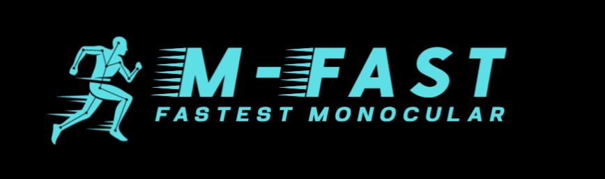

<p align="center"></p>

# M-fast 🏃‍♂️🏃🏃‍♀️
Mono AI 

## :one: 사용법

### :small_blue_diamond: Anaconda를 이용한 실행
#### :radio_button: 환경 설치
```bash
conda create -n {env_name} python=3.10.12
conda activate {env_name}
```

#### :radio_button: 필요 패키지 설치
```bash
(env_name) conda install -c conda-forge tqdm opencv -y
(env_name) conda install pyyaml
```

#### :radio_button: 학습
```bash
CUDA_VISIBLE_DEVICES={gpu} python train_backbone.py # 현재 미지원
CUDA_VISIBLE_DEVICES={gpu} python train_model.py --config {config_path}
```

* --config {config_path}: 학습할 네트워크 관련 설정파일(.yaml) 경로

예시
```bash
CUDA_VISIBLE_DEVICES='0' python train_model.py # 1 GPU Training
CUDA_VISIBLE_DEVICES='0,1' python train_model.py # 2 GPU Training
```


### :small_blue_diamond: Docker를를 이용한 실행


#### :radio_button: 빌드 및 실행
```bash
docker build --tag mfast .

docker run -it --rm --gpus='"device=0,1,2"' -v {M-fast 경로}:/M-fast -v {데이터셋 경로}:/dataset --shm-size=8g --network host mfast
```

#### :radio_button: 학습
```bash
python train_backbone.py # 현재 미지원
python train_model.py --config {config_path}
```

* --config {config_path}: 학습할 네트워크 관련 설정파일(.json) 경로

사용하는 GPU: 환경 실행시 설정한 GPU

## :two: Backbone
### :small_blue_diamond: 지원하는 모델
- [ ] Vgg16
- [ ] MobileNet-V1
- [ ] MobileNet-V2
- [ ] MobileNet-V3

### :small_blue_diamond: 지원하는 Dataset
- [ ] ImageNet
- [ ] OpenImagesV7
- [ ] PASS

### :small_blue_diamond: 성능
#### :radio_button: ImageNet Dataset
|Backbone|Method|Dataset|Top-1|Top-5|
|:---:|:---:|:---:|:---:|:---:|
|Vgg16|Classification|ImageNet|-|-|
|MobileNet-V1|Classification|ImageNet|-|-|
|MobileNet-V2|Classification|ImageNet|-|-|
|MobileNet-V3|Classification|ImageNet|-|-|

#### :radio_button: OpenImagesV7 Dataset
|Backbone|Method|Dataset|Top-1|Top-5|
|:---:|:---:|:---:|:---:|:---:|
|Vgg16|MOCO|OpenImagesV7|-|-|
|MobileNet-V1|MOCO|OpenImagesV7|-|-|
|MobileNet-V2|MOCO|OpenImagesV7|-|-|
|MobileNet-V3|MOCO|OpenImagesV7|-|-|

#### :radio_button: PASS Dataset
|Backbone|Method|Dataset|Top-1|Top-5|
|:---:|:---:|:---:|:---:|:---:|
|Vgg16|MOCO|PASS|-|-|
|MobileNet-V1|MOCO|PASS|-|-|
|MobileNet-V2|MOCO|PASS|-|-|
|MobileNet-V3|MOCO|PASS|-|-|
  
## :three: Model
### :small_blue_diamond: 지원하는 모델
#### :radio_button: 2016
- [ ] YoloV1 (You Only Look Once, CVPR 2016)
- [x] SSD (Single Shot MultiBox Detector, ECCV 2016)
  - vgg16, mobilenet-v1, mobilenet-v2, mobilenet-v3
- [ ] YOLO9000 (YOLO9000: Better, Faster, Stronger, CVPR 2017)

#### :radio_button: 2019
- [ ] CenterNet (Objects as Points, CVPR 2019)


### :small_blue_diamond: 지원하는 Dataset
- [x] VOC2007+2012 (PASCAL VOC, 20 classes)
- [x] COCO2017 (Common Objects in Context, 80 classes)
- [x] Crowd Human (Crowd Human, 2 class)
- [x] Argoseye (Argoseye, 1 class)

### :small_blue_diamond: 성능
* 일반적으로 mAP는 다음과 같이 적용된다.
 - AP<sup>small</sup> : 32x32 이하의 작은 객체, IOU 0.5:0.95
 - AP<sup>medium</sup>: 32x32 이상, 96x96 이하의 객체, IOU 0.5:0.95
 - AP<sup>large</sup> : 96x96 이상의 큰 객체, IOU 0.5:0.95
* 이미지 입력 크기가 다양한 상황에서 위 평가지표는 적절하지 않으므로, 다음과 같이 적용된다.
 - AP<sup>small</sup> : bounding box의 넓이가 (1/6)<sup>2</sup> 이하인 객체
 - AP<sup>medium</sup>: bounding box의 넓이가 (1/6)<sup>2</sup> 이상, (1/3)<sup>2</sup> 이하인 객체
 - AP<sup>large</sup> : bounding box의 넓이가 (1/3)<sup>2</sup> 이상인 객체
* 그리고 IoU threshold는 다음과 같이 적용된다.
 - AP<sup>small</sup> : 0.5
 - AP<sup>medium</sup>: 0.6
 - AP<sup>large</sup> : 0.7
* 평가를 위해 11 point, 101 point, all point 계산 방법을 지원하지만, COCO에서 사용한 101 point 계산 방법을 사용한다.
* VOC 데이터셋의 경우 Occlusion 등의 이유로 Difficulty한 객체는 mAP 계산에서 제외하지만, 포함하여 계산되었다.

#### :radio_button: COCO2017 Dataset
|Model|Backbone|Params|Flops|pretrained|AP<sup>0.5:0.95</sup>|AP<sup>50</sup>|AP<sup>75</sup>|AP<sup>small</sup>|AP<sup>midium</sup>|AP<sup>large</sup>|
|:---:|:---:|:---:|:---:|:---:|:---:|:---:|:---:|:---:|:---:|:---:|
|YoloV1|-|-|-|-|-|-|-|-|-|-|
|SSD|VGG16|42.7M|37.5G|Imagenet|-|-|-|-|-|-|
|SSD|Mobilenet-V1|-|-|Imagenet|-|-|-|-|-|-|
|SSD|Mobilenet-V2|16.69M|2.25G|Imagenet|-|-|-|-|-|-|
|SSD|Mobilenet-V3|-|-|Imagenet|-|-|-|-|-|-|

#### :radio_button: VOC2007+2012 Dataset
|Model|Backbone|Params|Flops|pretrained|AP<sup>0.5:0.95</sup>|AP<sup>50</sup>|AP<sup>75</sup>|AP<sup>small</sup>|AP<sup>midium</sup>|AP<sup>large</sup>|
|:---:|:---:|:---:|:---:|:---:|:---:|:---:|:---:|:---:|:---:|:---:|
|YoloV1|-|-|-|-|-|-|-|-|-|-|
|SSD|VGG16|42.7M|37.5G|Imagenet|-|-|-|-|-|-|
|SSD|Mobilenet-V1|-|-|Imagenet|-|-|-|-|-|-|
|SSD|Mobilenet-V2|16.69M|2.25G|Imagenet|-|-|-|-|-|-|
|SSD|Mobilenet-V3|-|-|Imagenet|-|-|-|-|-|-|

#### :radio_button: CrowdHuman Dataset
|Model|Backbone|Params|Flops|pretrained|AP<sup>0.5:0.95</sup>|AP<sup>50</sup>|AP<sup>75</sup>|AP<sup>small</sup>|AP<sup>midium</sup>|AP<sup>large</sup>|
|:---:|:---:|:---:|:---:|:---:|:---:|:---:|:---:|:---:|:---:|:---:|
|YoloV1|-|-|-|-|-|-|-|-|-|-|
|SSD|VGG16|42.7M|37.5G|Imagenet|-|-|-|-|-|-|
|SSD|Mobilenet-V1|-|-|Imagenet|-|-|-|-|-|-|
|SSD|Mobilenet-V2|16.69M|2.25G|Imagenet|-|-|-|-|-|-|
|SSD|Mobilenet-V3|-|-|Imagenet|-|-|-|-|-|-|